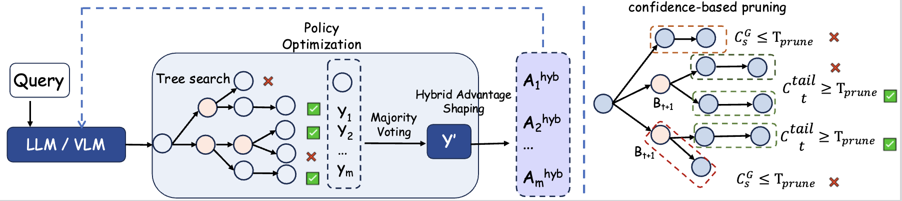
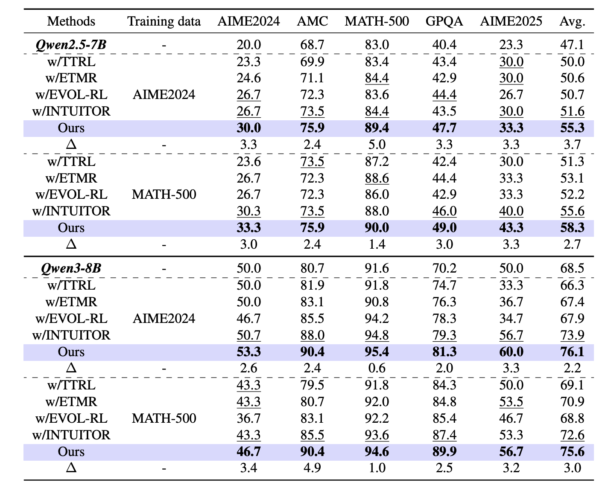

# 📒 OVERVIEW


------

This work proposes ECHO, an entropy–confidence hybrid test-time RL framework for self-improvement without external supervision. ECHO combines entropy–confidence guided tree-structured rollouts with online pruning to
focus computation on informative branches and avoid high-entropy traps. It further stabilizes optimization via confidence-adaptive clipping and entropy–confidence hybrid advantage shaping, prioritizing learning on uncertain yet decision-critical tokens. Extensive experiments validate its effectiveness.

-----

# 🚀 Quick Start
### 1. Installation
First, navigate to the verl directory and install the package:

```
cd ECHO/verl

conda create -n echo python==3.10
conda activate echo
bash scripts/install_ttrl_deps.sh
pip install -e .
```

### 2. 🌲 Code Structure

```
ECHO/
├─ LICENSE
├─ README.md
├─ figs/
└─ verl/
	├─ setup.py
	├─ data/
	├─ docs/
    ...
	├─ examples/
       ├─ ECHO
	├─ scripts/
	├─ tests/
	└─ verl/
       ├─workers/
        rollout/
        deepconf_branching.py 
        ...
```

### 3. 🏃🏻‍♀️ Reproduce ECHO
You can run the following script to train ECHO on AIME.
```
bash ECHO/verl/examples/ttrl_echo/Qwen2.5/aime.sh
```
Merge Checkpoint in Hugging Face Format：

```
bash 
```

For standalone testing, you can use the batch evaluation script:

```
python standalone_test.py 
```

# 📈 Main Results
 As shown in follow fig, ECHO steadily outperforms a range of testtime optimization methods and confidence baselines on both
Qwen2.5-7B and Qwen3-8B backbones, delivering consistent gains across different training setups. In aggregate,
ECHO delivers consistent average gains of 0.63%–12.36% across natural-language reasoning benchmarks, and can
achieve up to 12.36% improvements on the most challenging tasks (e.g., AIME2025). These results suggest that ECHO
more effectively filters low-quality trajectories and mitigates search degeneration across varying training distributions,
leading to reliable and sustained improvements in reasoning.

<p align="center">
	
</p>

#  🏡 Datasets and Baselines

<table>
	<thead>
		<tr>
			<th>Group</th>
			<th>Datasets</th>
		</tr>
	</thead>
	<tbody>
		<tr>
			<td>Text-only math</td>
			<td>AIME2025, AIME2024, AMC, MATH-500, GPQA-Diamond</td>
		</tr>
		<tr>
			<td>Vision/Multimodal</td>
			<td>Geometry3k, GeoQA, MathVision, MathVista, MathVerse, LogicVista</td>
		</tr>
	</tbody>
</table>

--------

We compare our method against the following baselines: [TTRL](https://github.com/PRIME-RL/TTRL), [MM-UPT](https://github.com/waltonfuture/MM-UPT), [EVOL-RL](https://github.com/YujunZhou/EVOL-RL/tree/main), [Intuitor](https://github.com/sunblaze-ucb/Intuitor).

# 🎁 Acknowledgment

Our method is built mainly on the open-source reinforcement learning framework Verl and the test-time reinforcement learning method TTRL. We thank them for their open-source contributions.